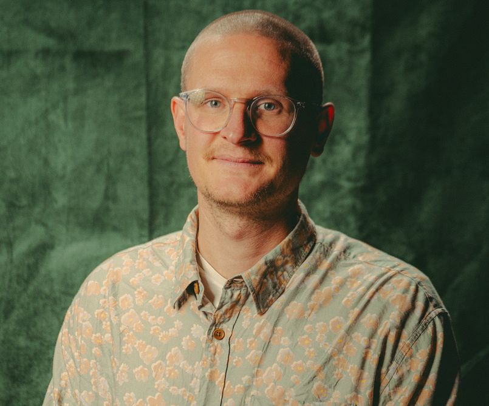

# About me

I (Willi Carlsen) am 37 years old and I work as a Cloud Engineer at DFDS. I live in Copenhagen with my family. My spare time is spend on family, friends, fishing, self hosting, programming, Linux, Nix, Kubernetes, the command line, Open-Source software, cloud computing/infrastructure, sailing, photography and much more.

