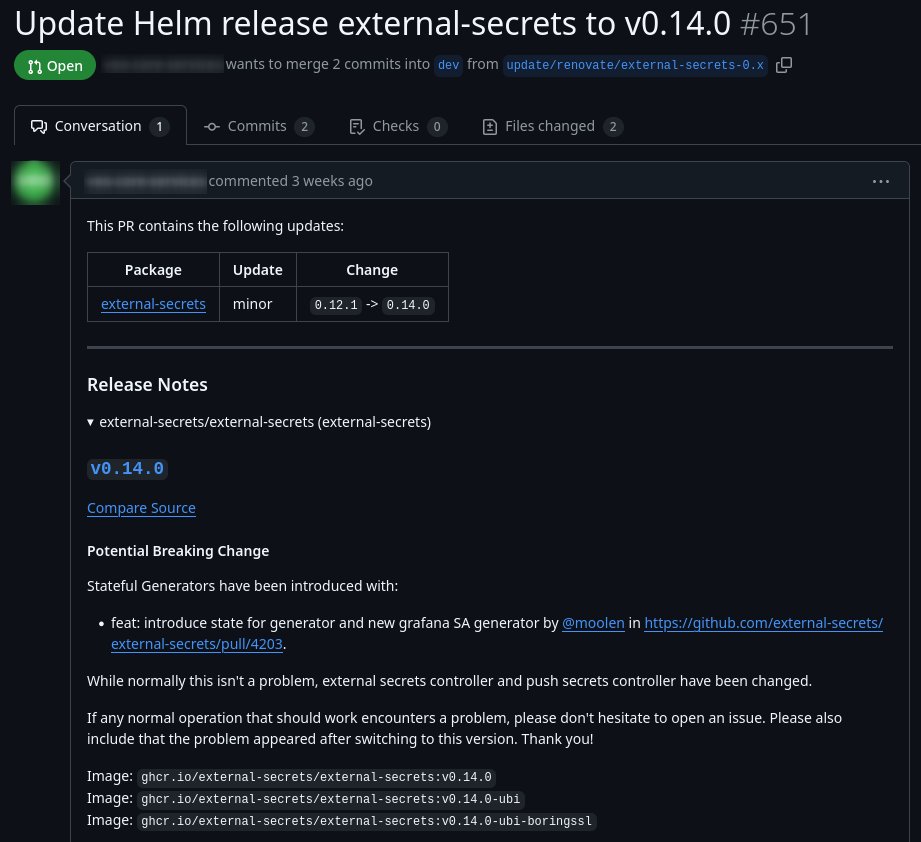

# Automatic dependency updates (Renovate)

I've for a while now been running selfhosted [Renovate](https://docs.renovatebot.com/) at work for handling automatic dependency updates for my team and I can only recommend it. It's like Github's dependabot but on steroids and very simple to setup.

Setup can be structured in two ways, I have implemented the latter.

* per repository - flexible but not very DRY (don't repeat yourself)
* centralised - not as flexible but very DRY

All that is needed is a `config.js` file.

```javascript
module.exports = {
  branchPrefix: 'update/renovate/',
  username: 'your-service-account-name',
  onboarding: false,
  requireConfig: 'optional',
  platform: 'github',
  repositories: [
    'wcarlsen/repository0',
    'wcarlsen/repository1',
  ],
  packageRules: [
    {
      matchUpdateTypes: [
        'digest',
        'lockFileMaintenance',
        'patch',
        'pin',
      ],
      minimumReleaseAge: '1 day',
      automerge: false,
      matchCurrentVersion: '!/(^0|alpha|beta)/',
      dependencyDashboard: true,
    },
    {
      matchUpdateTypes: [
        'minor'
      ],
      minimumReleaseAge: '7 day',
      automerge: false,
      matchCurrentVersion: '!/(^0|alpha|beta)/',
      dependencyDashboard: true,
    },
    {
      matchUpdateTypes: [
        'major'
      ],
      minimumReleaseAge: '14 day',
      automerge: false,
      dependencyDashboard: true,
    },
  ],
};
```

and a Github action and service account PAT.

```yaml
name: Renovate
on:
  schedule:
    - cron: "15 2 * * 1-5" # Every week day at 02.15
  workflow_dispatch:
jobs:
  renovate:
    runs-on: ubuntu-latest
    steps:
      - name: Checkout
        uses: actions/checkout@v4
      - name: Self-hosted Renovate
        uses: renovatebot/github-action@02f4fdeb479bbb229caa7ad82cb5e691c07e80b3 # v41.0.14
        env:
          LOG_LEVEL: ${{ vars.LOG_LEVEL || 'info' }}
          RENOVATE_INTERNAL_CHECKS_FILTER: none
        with:
          configurationFile: config.js
          token: ${{ secrets.RENOVATE_TOKEN }}
```

Local overwrites can be done in the repositories root with a `renovate.json`.

```json
{
  "$schema": "https://docs.renovatebot.com/renovate-schema.json",
  "packageRules": [
    {
      "matchPackageNames": ["registry.k8s.io/autoscaling/cluster-autoscaler"],
      "allowedVersions": "<1.33.0"
    }
  ]
}
```

Enjoy those well deserved automatic dependency updates.


