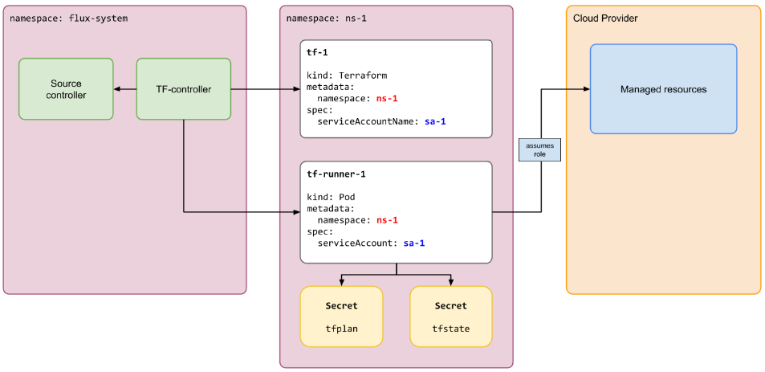

# OpenTofu enters the GitOps game

It has long been established that OpenTofu/Terraform is a strong tool for managing infrastructure, and for good reason. Write your changes, review the plan, and apply once you’re happy with the outcome. The wide landscape of providers and modules makes it hard to ignore for complex setups. Then Kubernetes controllers and GitOps entered the arena, with their fancy reconciliation loops, pull-based approach, and a different lifecycle than other tools. Suddenly Terraform and OpenTofu felt ancient and slow. In this post we will see if we can make OpenTofu catch up to Crossplane, ACK, and similar projects using [tofu-controller](https://flux-iac.github.io/tofu-controller/).

### Introduction to tofu-controller

Tofu-controller should be considered an extension of FluxCD version 2, because FluxCD is a requirement. It brings OpenTofu/Terraform capabilities to FluxCD by adding a `Terraform` CustomResourceDefinition and a tofu-controller Deployment to your cluster. A `Terraform` custom resource is very similar to FluxCD’s `Kustomization`. At its core, we need to reference a source like a Git repository, a path to find our OpenTofu code, and a reconciliation interval. FluxCD's source controller will then pull your repository, and tofu-controller will create a pod that runs `tofu apply` automatically at the specified path and reconciliation interval. There is, of course, more complexity and configuration options than discussed here, but this will suffice for now. In this simple example, we have extended OpenTofu with pull-based apply and drift detection (reconciliation). By default, tofu-controller uses Kubernetes Secrets as the remote state backend, but this can be overwritten. It also stores its plan in a Secret. Below I have borrowed a high-level diagram of how it works from their documentation.



Lastly, let's inspect a simple example of a minimal `Terraform` resource:

```yaml
apiVersion: infra.contrib.fluxcd.io/v1alpha2
kind: Terraform
metadata:
  name: example
  namespace: flux-system
spec:
  interval: 5m
  approvePlan: auto
  path: ./
  sourceRef:
    kind: GitRepository
    name: example-repository
    namespace: flux-system
```

### Conclusion

In conclusion this probably makes OpenTofu/Terraform somewhat relevant as an alternative to Crossplane, ACK and others. Tofu-controller isn't perfect in any way and should also be considered as a relative immature project. Personally I was positively surprised by the simplicity of the project and I would also consider it an viable option, because there are just so many benefits when it comes to the ecosystem around Opentofu/Terraform.
